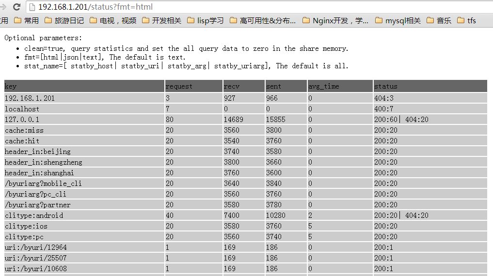

# Nginx statistics module 
   ngx_request_stats is a statistical nginx module. Statistical item is configurable, and can count different virtual hosts, different URL. You can request statistics including the number of times of each status code, the flowing output of the accumulated information, the average processing time, and so on. 
   
[中文版说明](README-cn.md)
# Table of contents 

* [Synopsis] (#synopsis) 
* [Compatibility] (#compatibility) 
* [Installation] (#installation) 
* [Variables] (#variables) 
* [Directives] (#directives) 
     * [shmap_size] (#shmap_size) 
     * [shmap_exptime] (#shmap_exptime) 
     * [request_stats] (#request_stats) 
     * [request_stats_query] (#request_stats_query) 
* [statistics Query] (#statistics-query) 
    * [text format] (#text-format) 
    * [html format] (#html-format) 
    * [json format] (#json-format) 
    * [Query and clear] (#query-and-clear) 
    * [Query By stats_name] (#query-by-status_name) 
* [Scoping] (#scope) 
* [Simple test script] (#simple-test-script) 
* [Related modules] (#see-also) 

# Synopsis
```nginx
http {
	request_stats statby_host "$host";	
	shmap_size 32m;
	shmap_exptime 2d;

	server {
		listen 81;
		server_name localhost;
		location / {
			echo "byhost:$uri";
		}
		location /404 {
			return 404;
		}
	}
	
	server {
		listen       80;
		server_name  localhost;

		location /stats {
			request_stats off; #do not stats.
			request_stats_query on;
			allow 127.0.0.1;
			allow 192.168.0.0/16;
			deny all;
		}

		location /byuri {
			request_stats statby_uri "uri:$uri";
			echo "byuri: $uri";
		}

		location /byarg {
			echo_sleep 0.005;
			request_stats statby_arg "clitype:$arg_client_type";		
			echo "login $args";
		}
		
		location /byarg/404 {
			request_stats statby_arg "clitype:$arg_client_type";		
			return 404;
		}

		location /byuriarg {
			request_stats statby_uriarg "$uri?$arg_from";	
			echo "$uri?$args";
		}

		location /byhttpheaderin {
			request_stats statby_headerin "header_in:$http_city";
			echo "city: $http_city";
		}
		
		location /byhttpheaderout/ {
			request_stats statby_headerout "cache:$sent_http_cache";
			proxy_pass http://127.0.0.1:82;
		}
	}

  server {
	listen       82;
	server_name  localhost;
	location /byhttpheaderout/hit {
		add_header cache hit;
		echo "cache: hit";
	}
	location /byhttpheaderout/miss {
		add_header cache miss;
		echo "cache: miss";
	}
  }
}
```

# Compatibility
This module is compatible with the following versions nginx: 
* 1.7.x (last tested: 1.7.4) 
* 1.6.x (last tested: 1.6.1) 
* 1.4.x (last tested: 1.4.7) 
* 1.2.x (last tested: 1.2.9) 
* 1.0.x (last tested: 1.0.15) 


# Installation
```
# echo-nginx-module just need to use for the test, this module does not depend on it. 
cd nginx-1.x.x 
./configure --add-module = path / to / ngx_request_stats \ 
--add-module = path / to / echo-nginx-module-0.49 / 
make 
make install 
```

# Variables
* nginx_core module supports variable: http://nginx.org/en/docs/http/ngx_http_core_module.html#variables 
* This module variables 
     * uri_full: uri before redirect. 
     * status: Http response codes 
     * date: current date in the format: 1970-09-28 
     * time: current time in the format: 12: 00:00 
     * year: current year 
     * month: current month 
     * day: current date 
     * hour: current hour 
     * minute: current minute 
     * second: current second 

# Directives
* [shmap_size] (#shmap_size) 
* [shmap_exptime] (#shmap_exptime) 
* [request_stats] (#request_stats) 
* [request_stats_query] (#request_stats_query) 

shmap_size
----------
**syntax:** *shmap_size &lt;size&gt;*

**default:** *32m*

**context:** *http*

Define shared memory size.

The **&lt;size&gt;** argument accepts size units such as k,m and g.

shmap_exptime
----------
**syntax:** *shmap_exptime &lt;expire time&gt;*

**default:** *2d*

**context:** *http*

Definition of statistical information in the shared memory expiration time. 

The **&lt;expire time&gt;** argument can be an integer, with an optional time unit, like s(second), m(minute), h(hour), d(day). The default time unit is s

request_stats
---------- 
**syntax:** *request_stats &lt;stats-name&gt; &lt;stats-key&gt;* 

**default:** *no* 

**context:** *http, server, location, location if* 

Statistics definition format, use the `request_stats off;` can close a statistic under the http, server, location. 
* stats-name is the name of the statistics (category), according to the function arbitrarily defined, in the back of the query command, you can specify the stats-name query specified statistical type. 
* stats-key definition of statistical key. key can be used the variables, and a string, so that different requests will be recorded separately. [Supported variable] (#variables) one lists all the supported variables. **Note: Do not use too randomized variables as key, this will cause each request has a statistical information, which take up a lot of shared memory space** 

#### Statistics by host 
```nginx 
request_stats statby_host "$host"; 
```
#### Statistics by uri 
```nginx 
request_stats statby_uri "uri: $uri"; # also adds uri: prefix. 
```
#### Statistics by get request parameters
```nginx 
request_stats statby_arg "clitype: $arg_client_type"; # press parameters client_type statistics 
```

#### Statistics by uri and parameters
```nginx 
request_stats statby_uriarg "$uri?$arg_from";	
```

### Statistics by request header 
```nginx 
request_stats statby_uriarg "header_in: $http_city"; 
```
### Statistics by response header
```nginx 
request_stats statby_uriarg "cache: $sent_http_cache"; 
```

request_stats_query
---------- 
**syntax:** *request_stats_query &lt; on &gt;* 

**default:** *off* 

**context:** *location* 

Open statistical query module. When turned on, you can have access to the statistics by the location. 
Statistics Query module has three optional arguments: 
* clean: is true that the query statistics and statistical items cleared for this query. 
* fmt: optional values: html, json, text, respectively, html, json, text format. The default format is text. html browser can be viewed directly, allowing you to json format using scripting language(eg. python/php) parsing results. text format in order to facilitate inquiries, and processed through awk and other shell commands. 
* stats_name: To count name queries, the statistics must be a name in the first parameter request_stats instructions specified in the stats-name. When this parameter is not specified, query all statistics. 


Minimum sample: 
```nginx 
location / stats {
request_stats_query on; 
} 
```
Statistics Query see [statistical inquiry] (#statistical-queries) a 

Statistics-Query
-------------- 
&nbsp; &nbsp; after opening request_stats_query, statistical results can be accessed via the corresponding uri, for example in the previous section configuration, access 
http://192.168.1.201/stats can display relevant statistics. **192.168.1.201 is my host** 

Query results typically has the following fields: 
* key, request_stats defined key 
* stats_time, statistics Start Time 
* request, the number of requests 
* recv, receiving the number of bytes 
* sent, bytes sent 
* avg_time, request the average time (in milliseconds) 
* stats, http response code, where 499 means the backend is timeout. 

&nbsp; &nbsp; ** the following query results are in operation [simple test script] after (# simple script to test) section of the test scripts produced. ** 

#### Text Format
http://192.168.1.201/stats
```bash
# Optional parameters:
# clean=true, query stats and set the all query data to zero in the share memory.
# fmt=[html|json|text], The default is text.
# stats_name=[ statby_host| statby_uri| statby_arg| statby_uriarg| statby_headerin| statby_headerout], The default is all.
key	stats_time	request	recv	sent	avg_time	stat
localhost	2014-08-31 22:16:47	1	0	0	0	 400:1
127.0.0.1	2014-08-31 22:16:29	80	14687	15854	0	 200:60, 404:20
cache:miss	2014-08-31 22:16:29	20	3560	3800	0	 200:20
cache:hit	2014-08-31 22:16:29	20	3540	3760	0	 200:20
header_in:beijing	2014-08-31 22:16:29	20	3740	3580	0	 200:20
header_in:shengzheng	2014-08-31 22:16:29	20	3800	3660	0	 200:20
header_in:shanghai	2014-08-31 22:16:29	20	3760	3600	0	 200:20
/byuriarg?mobile_cli	2014-08-31 22:16:29	20	3640	3840	0	 200:20
/byuriarg?pc_cli	2014-08-31 22:16:29	20	3560	3760	0	 200:20
/byuriarg?partner	2014-08-31 22:16:29	20	3580	3780	0	 200:20
clitype:android	2014-08-31 22:16:29	40	7400	10280	2	 200:20, 404:20
clitype:ios	2014-08-31 22:16:29	20	3580	3760	5	 200:20
clitype:pc	2014-08-31 22:16:29	20	3560	3740	5	 200:20
uri:/byuri/14858	2014-08-31 22:16:30	1	169	186	0	 200:1
uri:/byuri/10475	2014-08-31 22:16:30	1	169	186	0	 200:1
...
``` 
#### Html Format
http://192.168.1.201/stats?fmt=html


#### Json format 
http://192.168.1.201/stats?fmt=json
```json
{"Optional parameters":{
"clean":"clean=true, query stats and set the all query data to zero in the share memory.",
"fmt":"fmt=[html|json|text], The default is text.",
"stats_name":[" statby_host| statby_uri| statby_arg| statby_uriarg| statby_headerin| statby_headerout"]
},
"request-stat":{
"localhost":{"stats_time":"2014-08-31 22:16:47","request":2,"recv":0,"sent":0,"avg_time":0,"stat":{"400":2}},
"127.0.0.1":{"stats_time":"2014-08-31 22:16:29","request":80,"recv":14687,"sent":15854,"avg_time":0,"stat":{"200":60,"404":20}},
"cache:miss":{"stats_time":"2014-08-31 22:16:29","request":20,"recv":3560,"sent":3800,"avg_time":0,"stat":{"200":20}},
"cache:hit":{"stats_time":"2014-08-31 22:16:29","request":20,"recv":3540,"sent":3760,"avg_time":0,"stat":{"200":20}},
"header_in:beijing":{"stats_time":"2014-08-31 22:16:29","request":20,"recv":3740,"sent":3580,"avg_time":0,"stat":{"200":20}},
"header_in:shengzheng":{"stats_time":"2014-08-31 22:16:29","request":20,"recv":3800,"sent":3660,"avg_time":0,"stat":{"200":20}},
"header_in:shanghai":{"stats_time":"2014-08-31 22:16:29","request":20,"recv":3760,"sent":3600,"avg_time":0,"stat":{"200":20}},
"/byuriarg?mobile_cli":{"stats_time":"2014-08-31 22:16:29","request":20,"recv":3640,"sent":3840,"avg_time":0,"stat":{"200":20}},
"/byuriarg?pc_cli":{"stats_time":"2014-08-31 22:16:29","request":20,"recv":3560,"sent":3760,"avg_time":0,"stat":{"200":20}},
"/byuriarg?partner":{"stats_time":"2014-08-31 22:16:29","request":20,"recv":3580,"sent":3780,"avg_time":0,"stat":{"200":20}},
"clitype:android":{"stats_time":"2014-08-31 22:16:29","request":40,"recv":7400,"sent":10280,"avg_time":2,"stat":{"200":20,"404":20}},
"clitype:ios":{"stats_time":"2014-08-31 22:16:29","request":20,"recv":3580,"sent":3760,"avg_time":5,"stat":{"200":20}},
"clitype:pc":{"stats_time":"2014-08-31 22:16:29","request":20,"recv":3560,"sent":3740,"avg_time":5,"stat":{"200":20}},
"uri:/byuri/14858":{"stats_time":"2014-08-31 22:16:30","request":1,"recv":169,"sent":186,"avg_time":0,"stat":{"200":1}},
"uri:/byuri/10475":{"stats_time":"2014-08-31 22:16:30","request":1,"recv":169,"sent":186,"avg_time":0,"stat":{"200":1}}
}
}
```
#### query and clear
http://192.168.1.201/stats?clean=true 
After use clean = true parameter, this query results are still normal, but all result items will be cleared. 

#### Query by status_name
* http://192.168.1.201/stats?stats_name=statby_headerin 

```text 
key stats_time request recv sent avg_time stat 
header_in: beijing 2014-08-31 22:16:29 20 3740 3580 0 200: 20 
header_in: shengzheng 2014-08-31 22:16:29 20 3800 3660 0 200: 20 
header_in: shanghai 2014-08-31 22:16:29 20 3760 3600 0 200: 20 
```
* http://192.168.1.201/stats?stats_name=statby_uri 

```text 
key stats_time request recv sent avg_time stat 
uri: / byuri / 14858 2014-08-31 22:16:30 1 169 186 0 200: 1 
uri: / byuri / 10475 2014-08-31 22:16:30 1 169 186 0 200: 1 
uri: / byuri / 20090 2014-08-31 22:16:30 1 169 186 0 200: 1 
uri: / byuri / 7054 2014-08-31 22:16:30 1 168 185 0 200: 1 
uri: / byuri / 31520 2014-08-31 22:16:30 1 169 186 0 200: 1 
uri: / byuri / 22000 2014-08-31 22:16:30 1 169 186 0 200: 1 
uri: / byuri / 24415 2014-08-31 22:16:30 1 169 186 0 200: 1 
uri: / byuri / 20883 2014-08-31 22:16:30 1 169 186 0 200: 1 
```

# Scope
> request_stats directive scope are: 
`NGX_HTTP_MAIN_CONF | NGX_HTTP_SRV_CONF | NGX_HTTP_LOC_CONF | NGX_HTTP_LIF_CONF`, ie request_stats instructions at http, server, location, if peers can occur. However, due to this module is a plug-in NGX_HTTP_LOG_PHASE stage, a request will have a configuration item is valid. When they appear in different levels, only the innermost will start effect. Of course, if there are multiple request_stats instruction with the inside layer, a plurality will have effect. For example: 
```
http {
     # ... 
request_stats byhost "$host"; 
server {
listen 80; 
location / login {
echo "login"; 
} 
location / login_new {
request_stats byarg "$arg_client_type"; 
echo "login_new $args"; 
} 
} 
} 
```
##### Using the above configuration, if we make the following three requests: 
```shell 
curl http://127.0.0.1:80/login 
curl http://127.0.0.1:80/login_new?client_type=pc 
curl http://127.0.0.1:80/login_new?client_type=android 
```
##### Statistical results would be: 
```
key request recv sent avg_time 
android 1 187 210 0 
pc 1 182 205 0 
127.0.0.1 1 163 185 0 
```
/ login_new following request, since there is already a statistic called byarg will not repeat the statistics to byhost inside. Sometimes this may not be the result you want. If you want / login_new also statistics into byhost inside, you can add a request_stats instructions / login_new after the new configuration below: 
```
http {
     # ... 
request_stats byhost "$host"; 
server {
listen 80; 
location / login {
echo "login"; 
} 
location / login_new {
request_stats byarg "$arg_client_type"; 
request_stats byhost "$host"; 
echo "login_new $args"; 
} 
} 
} 
```
##### After retest results are as follows: 
```
key request recv sent avg_time 
127.0.0.1 3 532 600 0 
android 1 187 210 0 
pc 1 182 205 0 
```


#### Simple test script

This test corresponds to the configuration in the Synopsis section. 
Test depends on the curl command, make sure your system has been installed curl command line. 
[test.sh] (test.sh) source code directory 
```bash 
for ((i = 0; i <20; i ++)); do 
curl http://127.0.0.1:81/$RANDOM 
curl http://127.0.0.1:81/404/$RANDOM 
curl http://127.0.0.1:80/byuri/$RANDOM 
curl http://127.0.0.1:80/byarg?client_type=pc 
curl http://127.0.0.1:80/byarg?client_type=ios 
curl http://127.0.0.1:80/byarg?client_type=android 
curl http://127.0.0.1:80/byarg/404?client_type=android 
curl http://127.0.0.1:80/byuriarg?from=partner 
curl http://127.0.0.1:80/byuriarg?from=pc_cli 
curl http://127.0.0.1:80/byuriarg?from=mobile_cli 
curl http://127.0.0.1:80/byhttpheaderin -H "city: shanghai" 
curl http://127.0.0.1:80/byhttpheaderin -H "city: shengzheng" 
curl http://127.0.0.1:80/byhttpheaderin -H "city: beijing" 
curl http://127.0.0.1:80/byhttpheaderout/hit 
curl http://127.0.0.1:80/byhttpheaderout/miss 
done; 

```

# See Also
&nbsp; &nbsp; &nbsp; &nbsp; This module all statistical information is stored in memory, require the user to obtain relevant information, and then store the summary. On another project [ngx_req_stat] (https://github.com/jie123108/ngx_req_stat) is a request for statistics module, but it's more powerful, not only key is customizable, even the statistical value also can be customized . And statistical information stored in mongodb in. Project Address: (https://github.com/jie123108/ngx_req_stat) 

Authors
=======

* liuxiaojie (刘小杰)  <jie123108@163.com>

[Back to TOC](#table-of-contents)

Copyright & License
===================

This module is licenced under the BSD license.

Copyright (C) 2014, by liuxiaojie (刘小杰)  <jie123108@163.com>

All rights reserved.
